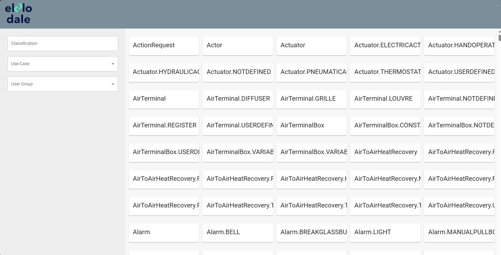
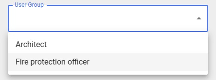
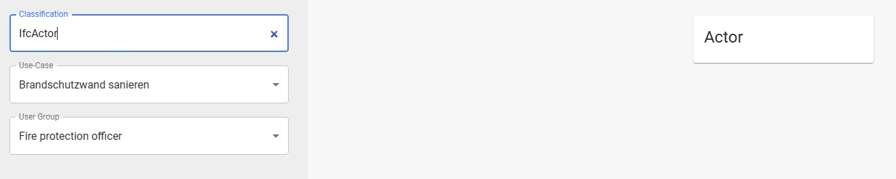
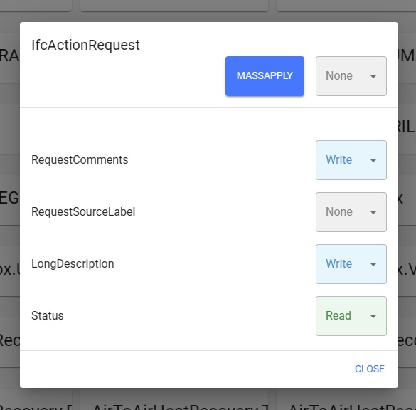
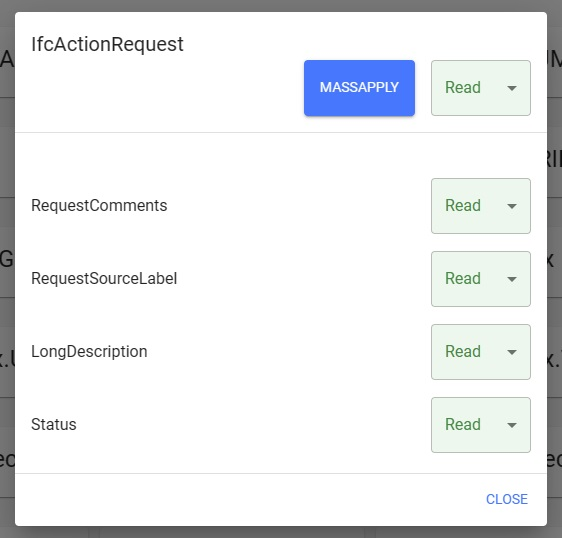

# Interface

## Overview

## Use-Case and User Group Select
First, a use case and a user group have to be selected.

## Search Bar
Then a classification can be selected through the overview or directly by searching.

## Classificaations
In the classification, the property access rights could be changed one by one.

## Massapply
Or directly mass applying it for the whole classification.

