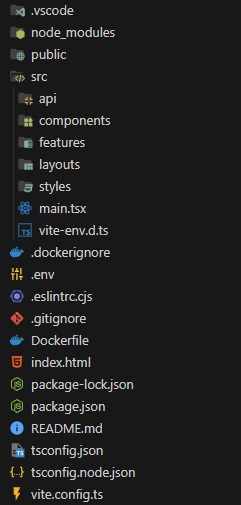
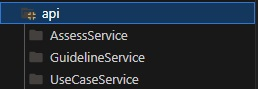
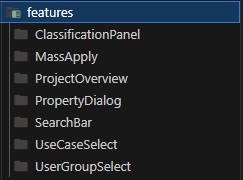
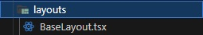
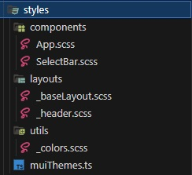

# Folder Structure

It's a feature-based folder structure, which means most of the components are saved within the feature folder.

All the generated API Clients are in the api/ folder.

The feature folder contains all the features that also reflect the same folder structure as the source folder.

The frontend still only uses a base layout.

Under the styles folder are feature independent components styling and utils, like colors or fonts.
