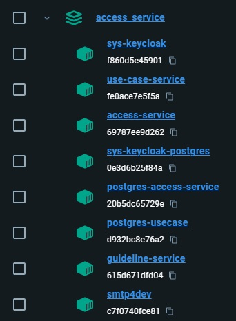

# Quick Setup

:::info

Make sure to install the Docker Desktop App.

:::

Under AccessService\System.Tools\\_docker\Local you will find the docker-compose.yml. Just open the terminal window in that directory and execute the docker compose file.

```tsx
docker-compose up -D
```

You should now have a collection of 8 containers under “access_service” in the container section of your Docker desktop app.

