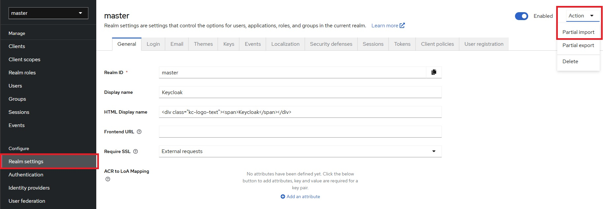
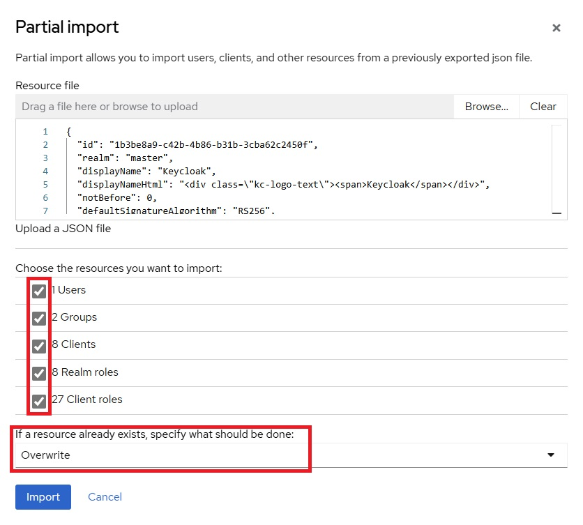
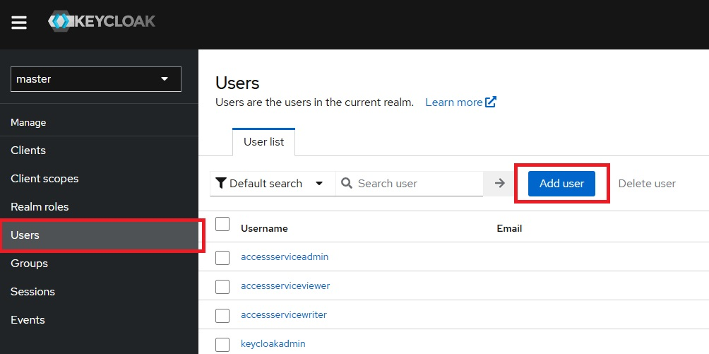
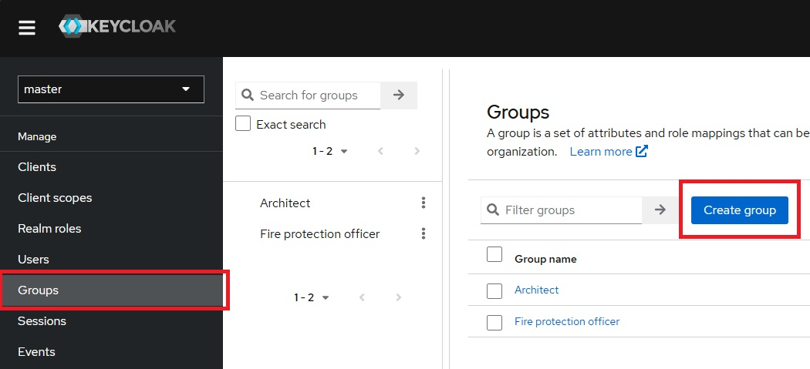
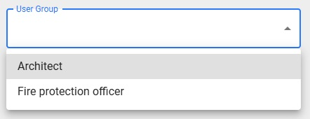
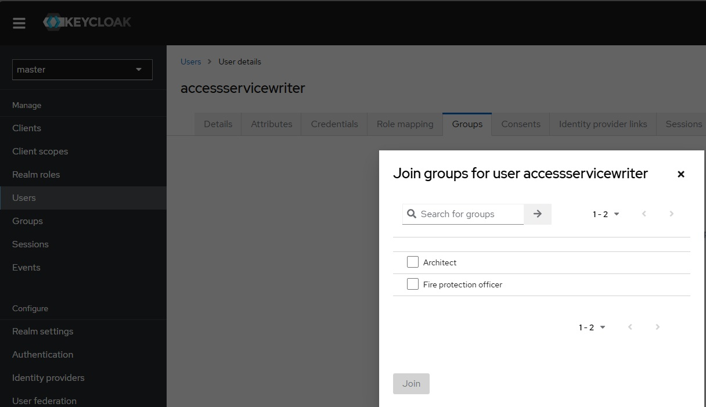

# Keycloak Setup

Keycloak is an open-source identity and access management tool. It is used to handle user authentication and authorization securely, ensuring only authorized users can access specific resources. This integration is essential for maintaining secure and efficient access control in our system.

We need Keycloak on the one hand to create groups for access rights management and on the other hand for authentication and permissions on the Access Service App.

You can reach Keycloak by default by visiting http://localhost:9345/.
Now we have to access the Keycloak interface. 
You get all the credentials from the .env in the docker folder.

## Import Settings

Navigate to the realm settings and click on “Action” in the top right-hand corner and select “Partial import”.

Click on “Browse” and select the keycloak.json for import under AccessService\System.Tools\\_docker\Local.

Then select all options and the “Overwrite” function. Then simply click on “Import” and restart the Docker container.

## Users

We can create users and assign them the appropriate roles to control their access in the app.

:::info

Please note that you are also a user, which is why there is a “keycloakadmin” user from the start. If you now access the Access Service, you are already logged in as this user.

:::

## Groups

You can create groups under the “Groups” section in the sidebar.

These groups are required for access rights management in the Access Service.

You can now also assign roles to these groups and to the users the groups from which they can also inherit the roles.

