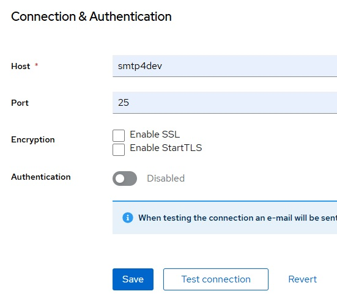

# Email SMTP Server Setup

This guide will walk you through the steps to configure an SMTP server for sending emails in Keycloak.

## Prerequisites

Before you begin, ensure you have the following:
- Access to your Keycloak admin console.
- SMTP server details (hostname, port, username, password, etc.).

## Steps

### Step 1: Access the Keycloak Admin Console

1. Open your browser and navigate to the Keycloak admin console.
2. Log in with your admin credentials.

### Step 2: Navigate to Realm Settings

1. In the left-hand menu, click on **Realms** to select your desired realm.
2. Click on **Realm Settings**.

### Step 3: Configure SMTP Settings

1. Select the **Email** tab within the Realm Settings.
2. Fill in the SMTP configuration fields as follows:

   - **From**: The email address that will appear in the "From" field of the emails sent by Keycloak.
   - **From Display Name**: The name that will appear in the "From" field alongside the email address.
   - **Host**: The SMTP server hostname (e.g., `smtp.example.com`).
   - **Port**: The SMTP server port (commonly 587 for TLS, 465 for SSL, and 25 for non-secure).
   - **Encryption**: Select the encryption type (None, SSL, or TLS).
   - **User**: The username for the SMTP server (typically the email address used for sending emails).
   - **Password**: The password for the SMTP server.
   - **Reply To**: (Optional) The email address to receive replies.
   - **Reply To Display Name**: (Optional) The display name for the reply-to address.

   

3. Click on **Save** to apply the settings.

### Step 4: Test the SMTP Configuration

1. After saving, click on the **Test Connection** button.
2. Keycloak will attempt to send a test email using the provided SMTP settings.
3. Check your email inbox for the test email to confirm that the configuration is correct.

## Troubleshooting

If the test email fails, consider the following:

- Double-check the SMTP server details (hostname, port, username, password).
- Ensure that the SMTP server is reachable from the Keycloak server.
- Verify the email account settings and permissions on the SMTP server.
- Check Keycloak logs for any error messages that can provide more details on the issue.

## Conclusion

By following these steps, you should have successfully configured an SMTP server for sending emails from Keycloak. This setup enables Keycloak to send various emails, such as account verification, password reset, and other notifications.

For more detailed information, refer to the [Keycloak documentation](https://www.keycloak.org/docs/latest/server_admin/).

