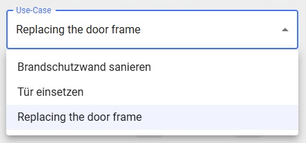
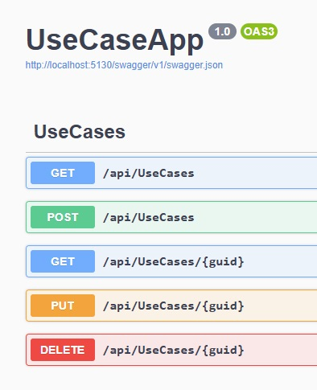
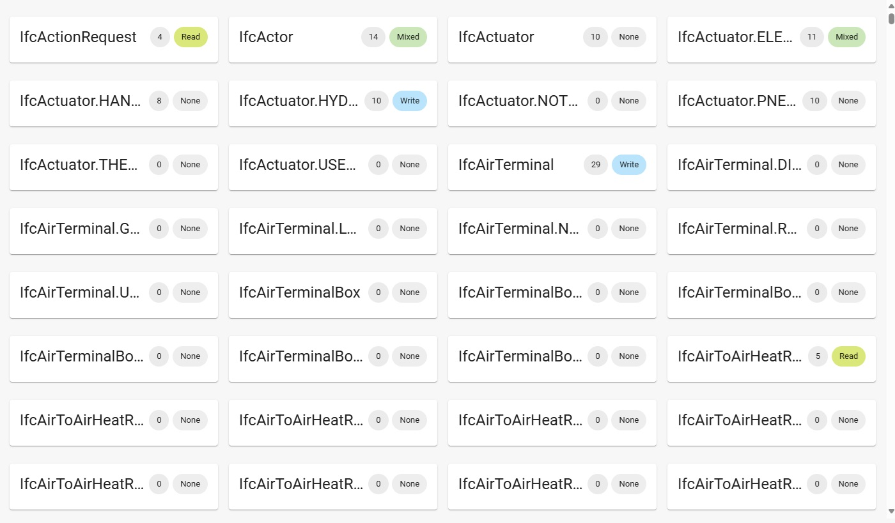
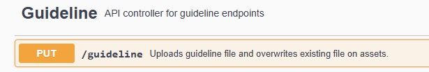

# Service Dependencies

All services on which the Access Service is dependent are explained here.

## Use Case Service

We need the Use Case Service to manage use cases and use them in the Access Service.

At present, you can only feed use cases into the Use Case Service via the Swagger interface.
You can access the interface at http://localhost:5130/swagger.

### Creating use cases

To create a new use case, use the Swagger interface. Select the "POST /api/UseCases" endpoint, 
fill in the required details, and execute the request to add a new scenario.

### Getting use cases

Retrieve existing use cases via the Swagger by selecting the "GET /api/UseCases" endpoint. 
This will return a list of all defined use cases for review.

### Updating use cases

To update a use case, use the "PUT /api/UseCases/[guid]" endpoint in the Swagger interface. 
Specify the use case ID, make the necessary changes, and execute the request to save the updates.

### Deleting use cases

Remove an unwanted use case by selecting the "DELETE /api/UseCases/[guid]" endpoint in the Swagger interface. 
Specify the use case ID and execute the request to confirm the deletion.

## Guideline Service

We need the Guideline Service to display classifications and associated properties in the Access Service.

If you want to upload a guideline, it is currently only possible via the Swagger Api interface. 
You can access this at http://localhost:5008/swagger.

You can upload and update the guideline under the [PUT] /guideline endpoint.
You do not need to do anything else here.

:::warning

Very large guidelines might cause the Swagger interface to hang. Simply wait a few minutes and then close it. The guideline should still be saved.

:::