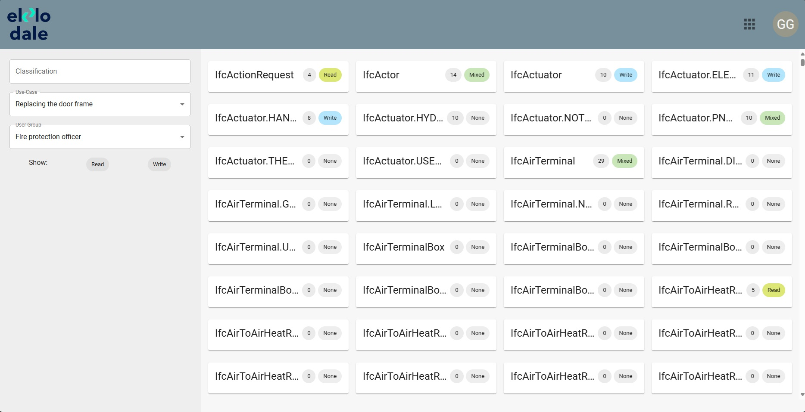
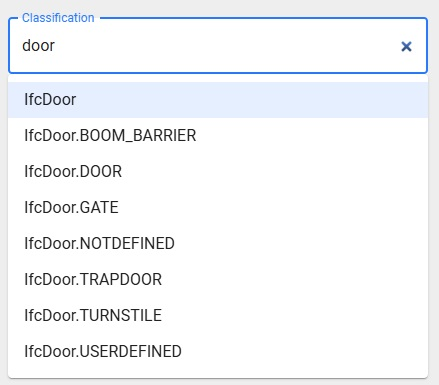
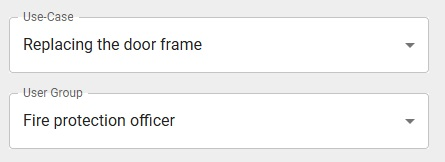

# User Interface Overview

In the image, you can see the classifications from the uploaded guideline.

## Search Bar

However, if your guideline is somewhat larger and you have hundreds of classifications on the screen, the search bar will help you out. Simply type in which classification you are looking for and the auto-completion will show you what is available.

## Use Case and User Group Select

Just don't forget to select a use case and a user group for which you want to see or change the access rights.

## Access Right Filters

However, if you only want to see classifications for which the access rights have already been set, you can filter by “Read”, “Write” or both.

## Classification in Detail

In the Selected classifications you can now see the name of the classification, how many properties it has and which rights have been set in it. If the properties in the classification have been set to "Read" and "Write", it is displayed as “Mixed”.

