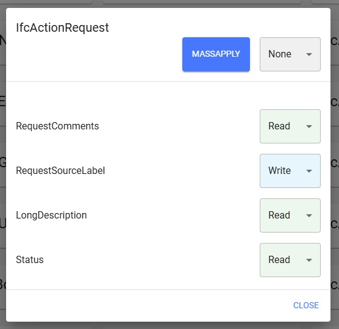
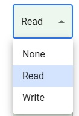

# Classification

If you have selected a classification, you can see its properties and the access rights assigned to it.

If you have the authorization, you can change the access rights of the individual properties. The access rights are saved immediately after the change.

As an admin, you can also set the entire classification to a specific access right by using the Mass Apply function.

You will receive a notification of the success of each change.

