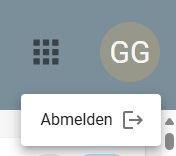
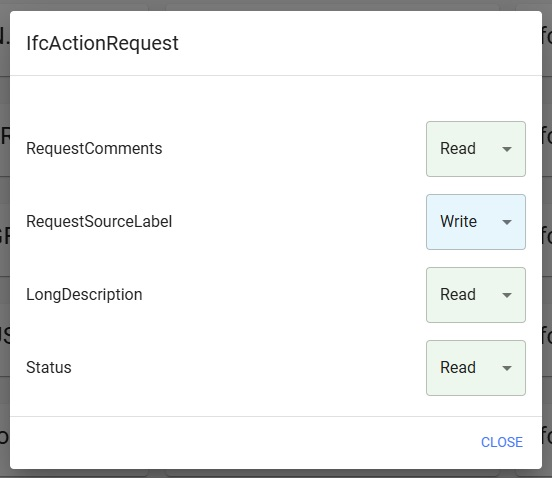
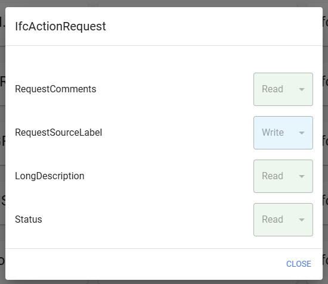

# User Permissions

If you have previously logged in with Keycloak, you will automatically be logged in for the Access Service.
In the top right corner you will find your user avatar consisting of your initials, if you click on it you have the option to log out.

## Roles

Currently, the different roles mainly differ in the Access Service in terms of editing access rights.

### Admin [access_service_admin]
Is the Admin role and has access to all functionalities of the Access Service.

### Write [access_service_writer]
The Writer role can set the individual access rights to “Read” and “Write” in the properties, but does not have access to the Massapply functionality.

### Viewer [access_service_viewer]
The viewer role can only see which access rights the properties have, but cannot change them.

