# Introduction

This document guides you through the Access Rights module: where you decide which parts of the
data model a user group may see and change.

Access in gaeco is not granted per screen or per feature. It is granted **per property**, for
one **user group**, within one **UseCase**. That combination is the unit — the same building
can be fully editable in one UseCase and invisible in another, for the same person.

Configuring access is the third of the three setup steps the
[start page](https://github.com/gaeco-ekkodale/Homepage) asks for, and it is what makes the
[Instances module](https://github.com/gaeco-ekkodale/InstanceService) usable: a
classification without write access cannot be chosen when creating data.

# Prerequisites

- The `Access Client` must be running as a plugin inside the Plugin Host.
- The `Access Server` and `Access Postgres` must be running.
- The following services must also be running:
  - `Keycloak` — the user groups come from there
  - `MiniO`
  - `Kafka`
  - `PluginHost Service`
  - `AppOrchestrator`
  - `Guideline Service`
  - `UseCase Service`
- A valid **guideline** must be uploaded via
  [Platform Config](https://github.com/gaeco-ekkodale/PlatformConfig).
- At least one **UseCase** must exist, created in the
  [UseCases module](https://github.com/gaeco-ekkodale/UseCaseService).

## Editing Requires an Admin Role

Everyone can *view* the configured rights. **Changing** them requires the role named by
`VITE_ADMIN_ROLE_NAME` (default `admin`) to be present in your access token under
`resource_access.<VITE_KEYCLOAK_CLIENT_ID>`.

The shipped realm already arranges that: the `Admin` group carries the `admin` role on every
module's client, so an account in that group can edit.

If the role is missing, the module still loads and still shows every classification and
property — but read-only: the per-property selectors are disabled and the **MassApply** control
is not rendered at all. That looks like a broken permission check rather than a missing role, so
it is worth knowing the difference. The usual cause is a `VITE_KEYCLOAK_CLIENT_ID` naming a client
the token has no entry for: the check then finds nothing under `resource_access` and denies, exactly
as it would for a user without the role.

# General Usage

The module opens empty. Nothing is listed until a context has been set, because permissions
always apply to one exact combination.

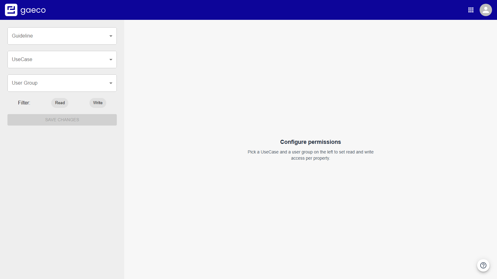

The three selectors on the left are that context.

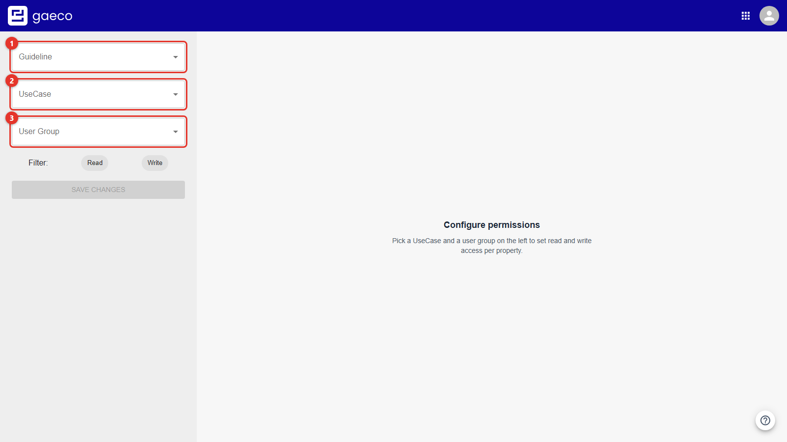

| Selector | Meaning |
| --- | --- |
| **Guideline** | Optional. Scopes the classification list to one data model |
| **UseCase** | Required. The working context the rights apply in |
| **User Group** | Required. Managed in Keycloak; the default group is `Admin` |

## Selecting a UseCase

If the list is empty, the UseCase Service is either not running or no UseCase has been created
yet.

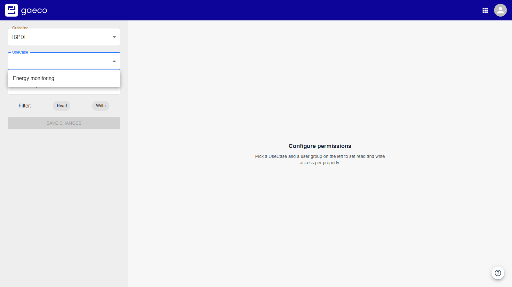

## Selecting a User Group

User groups are not managed here — they come from Keycloak. The group determines whose
permissions you are editing, so switching it changes what is displayed even though the UseCase
stays the same.

Once both are set, every classification of the data model appears as a card.

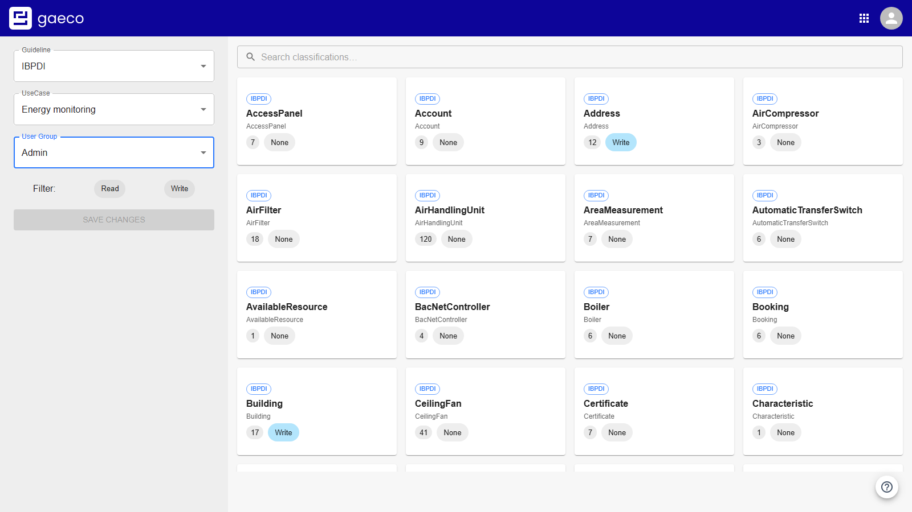

Each card shows the classification name, how many properties it has, and the right currently in
effect: `None`, `Read`, `Write`, or **`mixed`** when its properties do not all agree.

## Why the Guideline Selector Exists

A real data model is large — IBPDI has several hundred classifications. Two things follow.

First, use the **search box** above the cards rather than scrolling.

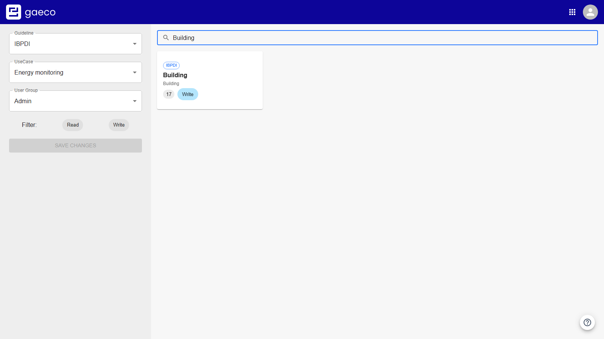

Second, if more than one guideline has been uploaded, each contributes its own classifications
and near-identical cards appear side by side. The **Guideline** selector scopes the list back to
a single model. (Uploading a second guideline instead of replacing the first is usually not what
you want — see
[Platform Config](https://github.com/gaeco-ekkodale/PlatformConfig).)

# Setting Rights per Property

This is the part that distinguishes gaeco's permissions from a simple per-screen or
per-classification model: **a right is stored for one single property.** A user group can be
allowed to read a building's name, edit its building code, and not see its market value at
all — three different rights within the same classification, in the same UseCase.

Click a classification card to open it. What you see first are its **property sets**, the
groupings the guideline defines. They are collapsed, so the properties are one click away.

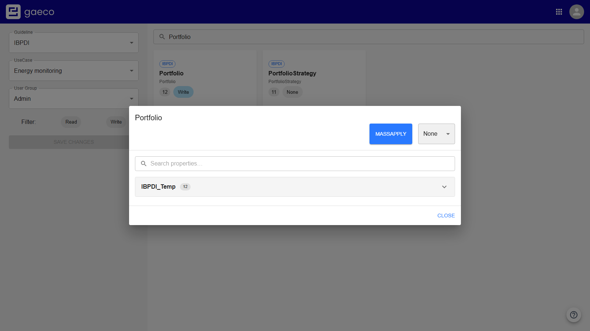

Expand a set and every property it contains is listed, each with its own selector.

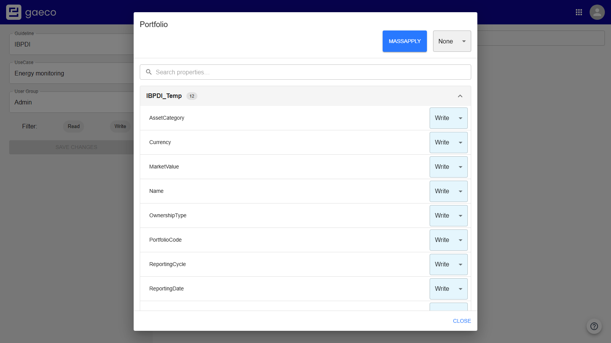

The same grouping is used when the property is later shown in a form, so a set that reads
sensibly here reads sensibly in the Instances module too.

## The Three Rights

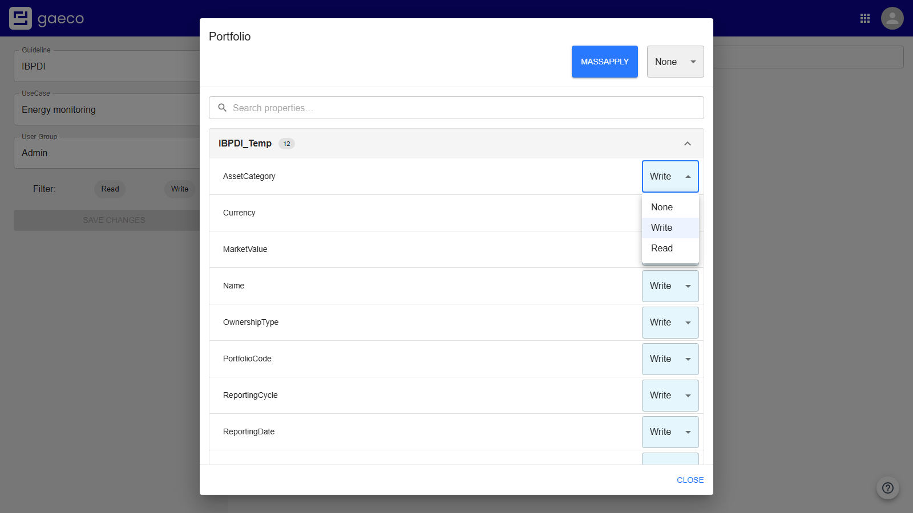

| Right | Effect for the user group |
| --- | --- |
| `None` | The property is **hidden** — not shown as locked, simply absent |
| `Read` | The property is shown but cannot be changed |
| `Write` | The property is shown and can be changed |

That `None` **hides** rather than disables is the single most useful thing to know here. Someone
reporting that a field "does not exist" is usually looking at a `None`, not at a gap in the
guideline — and the same applies one level up: a classification with no writable property at all
is not offered when creating an instance.

Setting one property changes only that property. Everything else in the set keeps whatever it had.

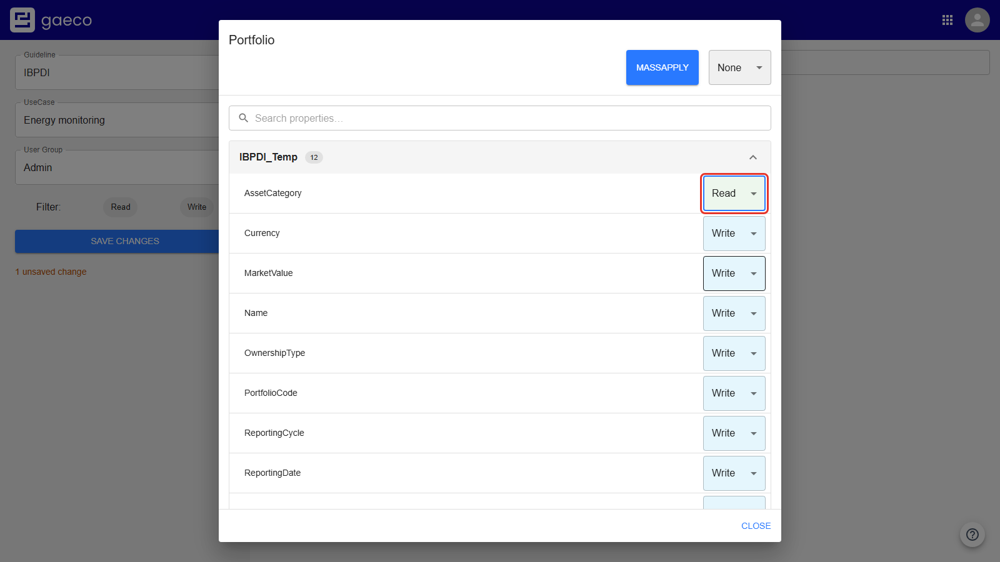

A classification whose properties do not all agree is labelled **`mixed`** on its card. That is
the normal state for a carefully configured model, not a warning.

## Finding a Property

A classification can carry dozens of properties, so the dialog has a search of its own.

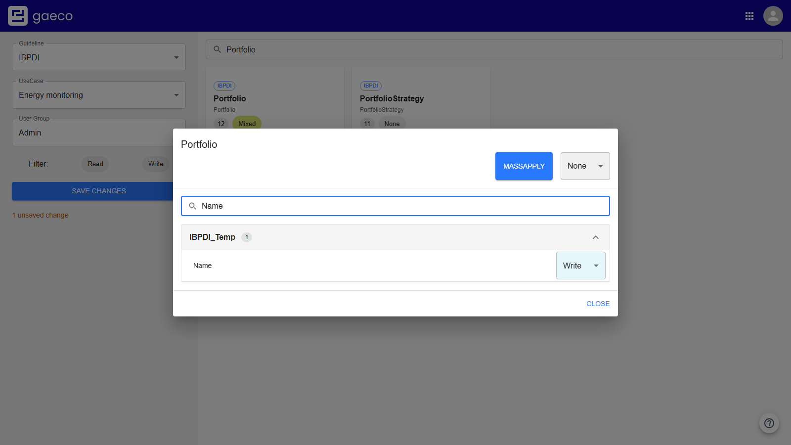

## MassApply

Setting several hundred properties one at a time is not practical, so the same three choices can
be applied to a whole classification at once. Pick a right in the selector beside **MassApply**:

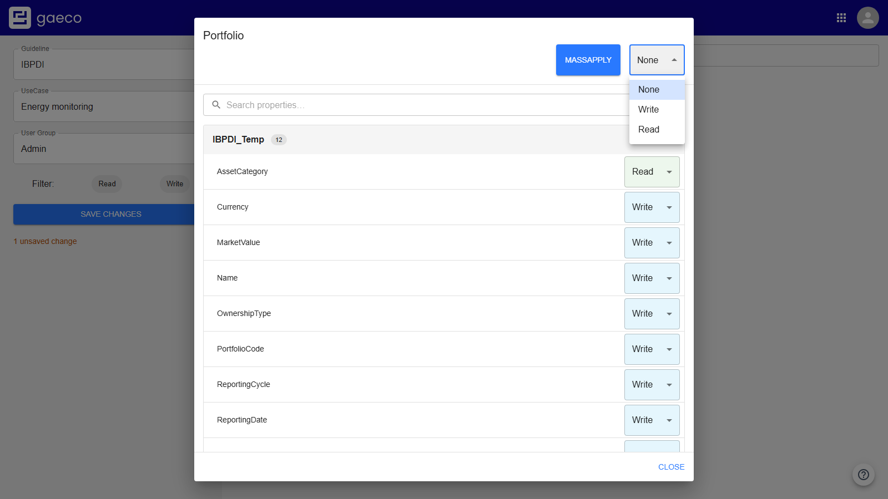

Then press **MassApply**.

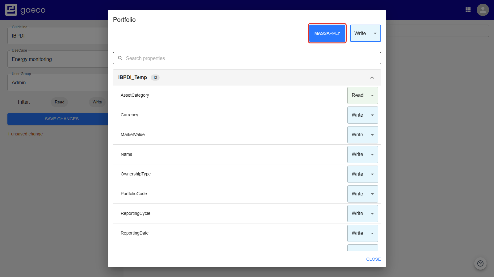

The usual way to work is MassApply first to set a baseline for the classification, then adjust the
few properties that need to differ. Note that MassApply overwrites the individual settings — doing
it in the other order loses them.

Only administrators may assign `None`. Attempting it without the role is rejected with a message
rather than silently ignored.

# Saving

Nothing takes effect while you work. Edits are collected as pending changes, and the count is shown
next to **Save changes** — so a whole classification, or several, can be worked through before
anything is written. The control is inactive while nothing is pending, which is also the quickest
way to tell whether an edit registered at all.

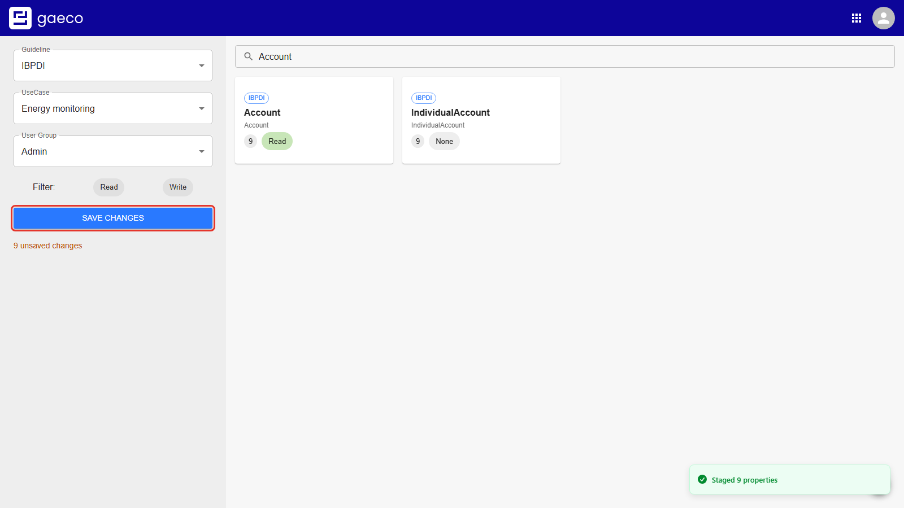

Choosing it writes them all at once.

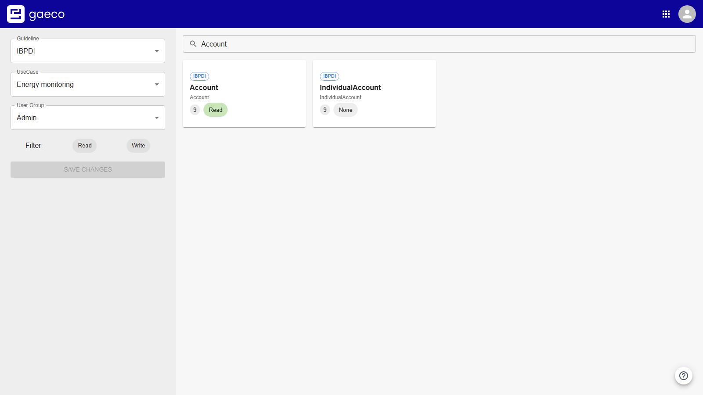

Afterwards it goes idle again, because the displayed state now matches what is stored.

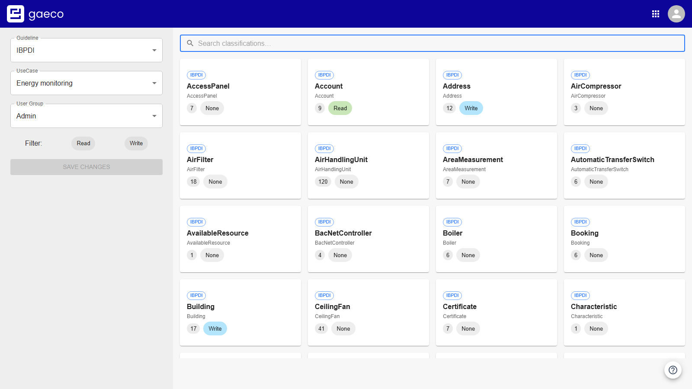

Switching UseCase or user group while edits are pending prompts first, so a context switch does
not quietly discard work.

# Filtering by Right

The **Read** and **Write** buttons filter the list to classifications that have at least one
property with that right. Activating both shows those that have either, which is how you find
`mixed` classifications.

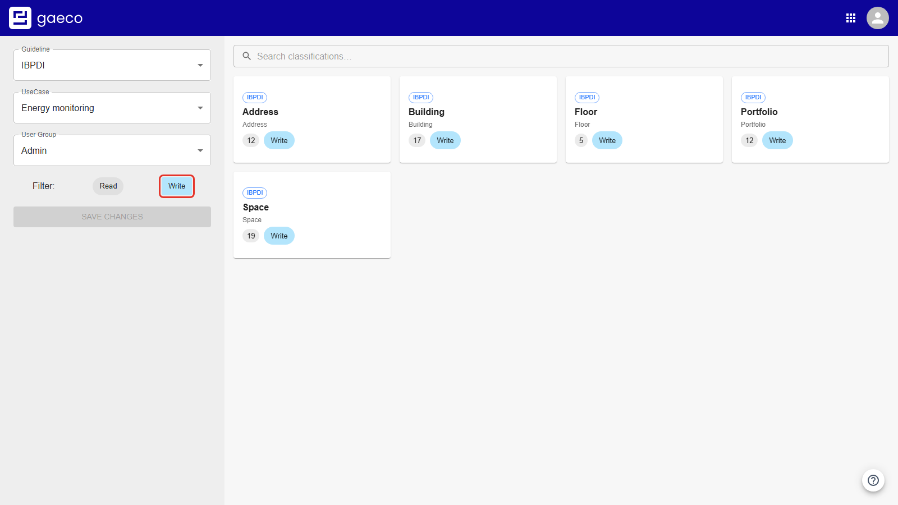

With no filter active, every classification of the guideline is listed — including the many that
have no rights configured at all. With a filter active, the list shrinks to what has actually
been configured, which is normally the shorter and more useful view.

# The Built-in Tour

The help button replays the module's own explanation at any time.

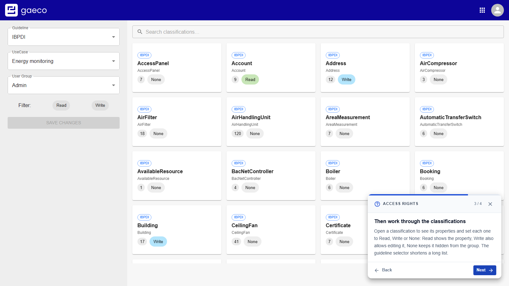

# When Something Is Missing

- **The selectors stay disabled and no classifications appear.** The guideline has not reached
  the Access Service yet. An upload is published over Kafka and each service rebuilds its own
  view of the model; for a large guideline that takes noticeably longer than the upload itself.
  Wait, then reload.
- **Properties are shown but cannot be changed.** Your token carries no admin role for the
  configured Keycloak client — see [above](#editing-requires-an-admin-role).
- **A classification cannot be selected in the Instances module.** It has no write access in
  that UseCase for your group. That is this module's job, not a fault in Instances.

# Related Documentation

- The deployment repository's user guide — all three setup steps in order
- [Platform Config](https://github.com/gaeco-ekkodale/PlatformConfig) — the data model the
  rights refer to
- [UseCases](https://github.com/gaeco-ekkodale/UseCaseService) — the contexts rights apply in
- [Instances](https://github.com/gaeco-ekkodale/InstanceService) — what the rights govern
